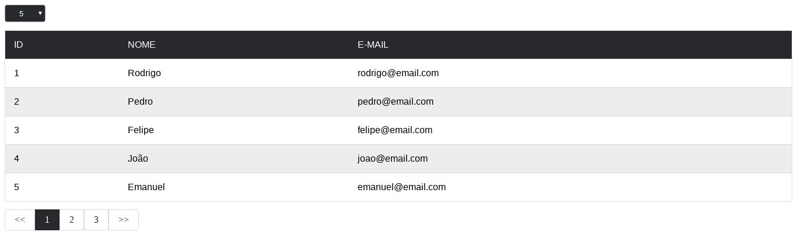

# Attention!
still under construction

# myTable
Dynamic table created in pure javascript using the DOM, Promise and XMLRequest API.



## Quick start

### Installing
To install add these files to your project
```html
<link rel="stylesheet" type="text/css" href="style.css">
<script src="myTable.js"></script>
```
### Inserting data into the table
To use data from a variable use the following code
```javascript
     myTable({
         tableDiv: "myTable",
         pager: "pager",
         mockup: data,
         rowList: [5, 10, 25, 50],
         colNames: [
             { name:"Id", index:"id" },
             { name:"Nome", index:"name" },
             { name:"E-mail", index:"email" }
         ]
     });
```
To use data from an API use the following code
```javascript
     myTable({
        tableDiv: "myTable",
        pager: "pager",
        url:"http://your-url.com/api",
        datatype: "json",
        rowList: [5, 10, 25, 50],
        colNames: [
            { name:"Id", index:"id" },
            { name:"Nome", index:"name" },
            { name:"E-mail", index:"email" }
        ]
    });
```
